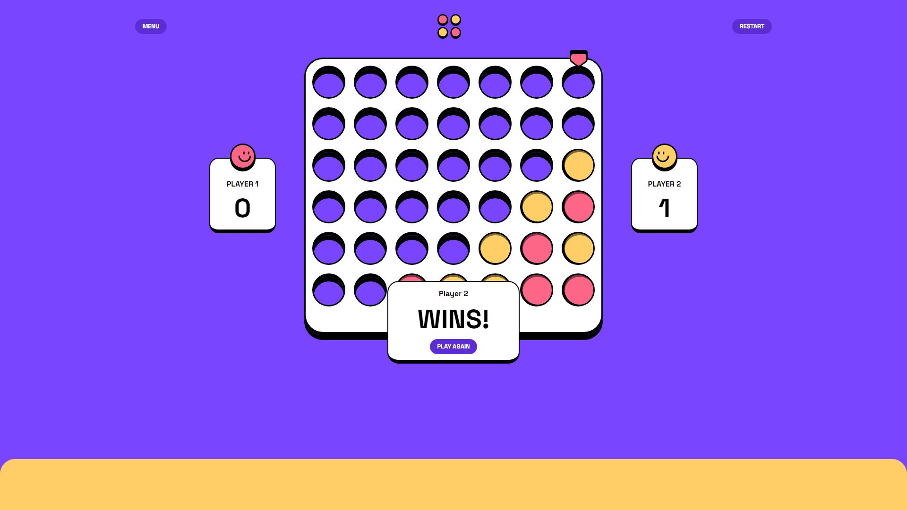

# Connect Four Game

This is a solution to the [Connect Four game challenge on Frontend Mentor](https://www.frontendmentor.io/challenges/connect-four-game-6G8QVH923s).

## Table of contents

- [Overview](#overview)
  - [The challenge](#the-challenge)
  - [Screenshot](#screenshot)
  - [Links](#links)
- [My process](#my-process)
  - [Built with](#built-with)
  - [What I learned](#what-i-learned)
  - [Continued development](#continued-development)
  - [Useful resources](#useful-resources)
- [Author](#author)

## Overview

### The challenge

Users should be able to:

- View the game rules
- Play a game of Connect Four against another human player (alternating turns on the same computer)
- View the optimal layout for the interface depending on their device's screen size
- See hover and focus states for all interactive elements on the page
- Play against the computer

### Screenshots





### Links

- Solution URL: [My Frontend Mentor Solution page](https://your-solution-url.com)
- Live Site URL: [Connect 4 Game](https://helsel-connect-four-game.netlify.app/)

## My process

### Built with

- Flexbox
- CSS Grid
- Mobile-first workflow
- [React](https://reactjs.org/) - JS library
- [TailwindCSS](https://tailwindcss.com/)
- [Vite](https://vitejs.dev/)

### What I learned

This project required learning a fair bit more about React hooks. I've been very comfortable with `useState()` for a while, but time elements here required the use of `useEffect()` and `useRef()`. The code to add a delay to the CPU player's move took a long time and lots of headaches to implement.

```js
const timerId = useRef()

useEffect(() => {
    if (vsCPU && currentPlayer === 'o' && !timerId.current && winner === '') {
        const id = setTimeout(() => {
            const cpuCol = cpuMove(board, 'o');
            addToken(cpuCol);
            clearTimeout(timerId.current)
            timerId.current = false;
        }, ((Math.random() * 850) + 350)); //Randomize delay to make it feel more like the bot is "thinking"
        timerId.current = id;
    }
}, [board, currentPlayer, vsCPU])
```

### Continued development

The CSS on this could really use some work both in terms of design accuracy and eliminating redundancy. I also plan to do a pass and add more comments to critical parts of the code.

This project could probably use real routing, as currently a `useState` variable determines which main component is being rendered.

```js
function App() {
  const [gameState, setGameState] = useState('mainMenu');

  return (
    <div className={`h-screen bg-purple overflow-hidden | flex flex-col ${(gameState === "gamePVP" || gameState == "gameCPU") ? "justify-start" : "justify-center"} items-center`}>
      {gameState === "mainMenu" ? <MainMenu setGameState={setGameState}/> : <></>}
      {gameState === "gamePVP" ? <Game setGameState={setGameState}/> : <></>}
      {gameState === "gameCPU" ? <Game setGameState={setGameState} vsCPU={true}/> : <></>}
      {gameState === "rules" ? <Rules setGameState={setGameState}/> : <></>}
    </div>
  );
}
```

I've yet to use routing in React but this could be a great oppurtunity to learn.

I would also like to animate the discs falling into position. That may require a pretty signifigant refactor however.

### Useful resources

- [theLoneCoder0's connect-four game](https://github.com/theLoneCoder0/connect-four) - This helped me for XYZ reason. I really liked this pattern and will use it going forward.
- [ChatGPT](https://chat.openai.com/) - ChatGPT is really bad at writing working code, but I find when I get stuck it can at least help me get the gears turning a little by throwing out some valid ideas. I had a lot of trouble figuring out how to use `setTimeout()` in React for my specific use case, but ChatGPT helped me realized using a conditional from within a useEffect hook was part of the solution. It also provided the bones of my CPU player script, cutting down some of the work for that implementation.
- [Felix Gerschau - Using setTimeout in React components](https://felixgerschau.com/react-hooks-settimeout/) - This didn't fully solve the issue I was facing with setTimeout either, but the article did teach me about clearing timers with the `useRef()` hook as well as some other broad concepts.


## Author

- Website - [Jeremy Helsel](https://jeremyhelsel.com/)
- Frontend Mentor - [@JIH7](https://www.frontendmentor.io/profile/JIH7)
